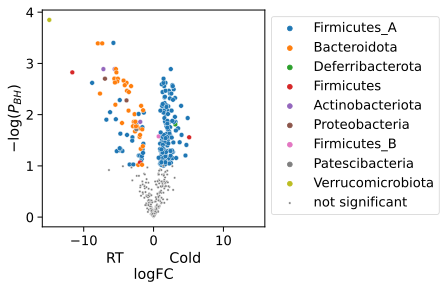
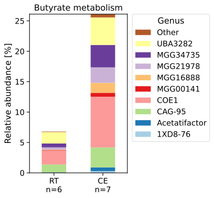

# Comprehensive Mouse Gut Metagenome (CMGM) catalog

> Comprehensive mouse gut metagenome catalog reveals major difference to the human counterpart. Kieser, S., Zdobnov, E. M. & Trajkovski, M. bioRxiv 2021.03.18.435958 (2021). doi:[10.1101/2021.03.18.435958](https://doi.org/10.1101/2021.03.18.435958)

Here is a [jupyter notebook](notebooks/Analyze-cold-adapted-microbiota.ipynb) that shows how CMGM can be used for the analysis of mouse metagenome data.

 

The same code can be used for the analysis of human metagenome data, by using our [functionally annotions](https://ezmeta.unige.ch/CMGM/v1/Human_data/) of the Unified human gastrointestinal genome collection.
